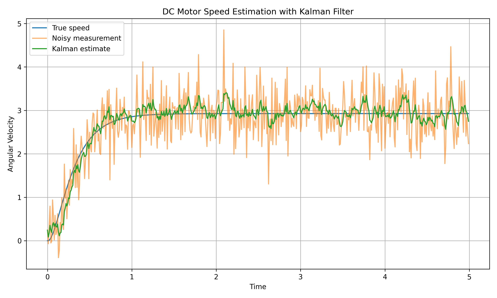
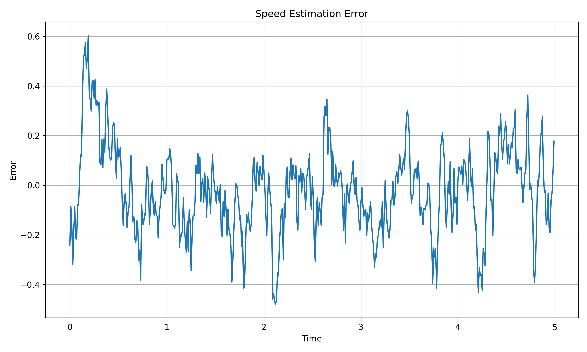
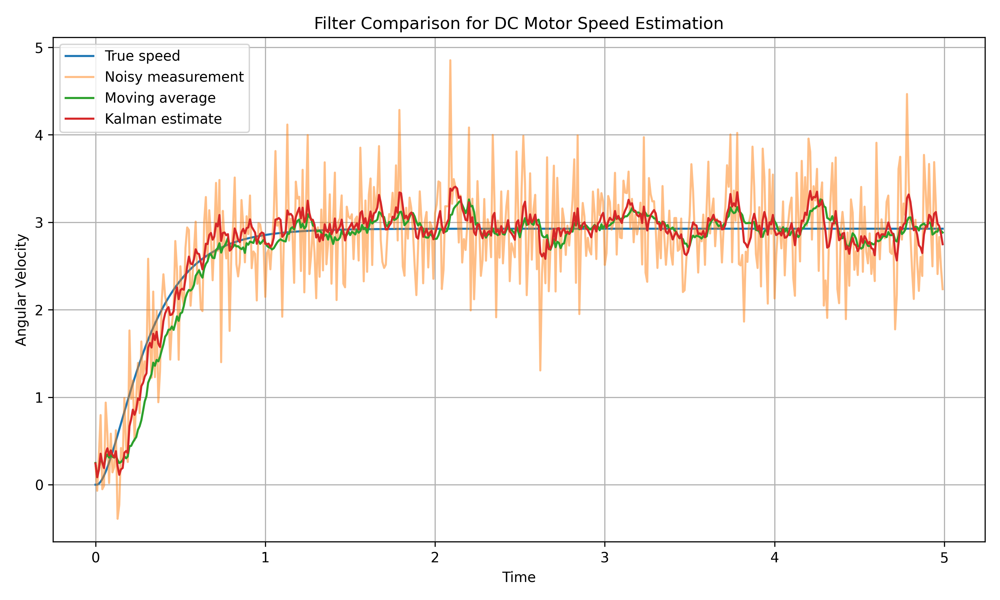
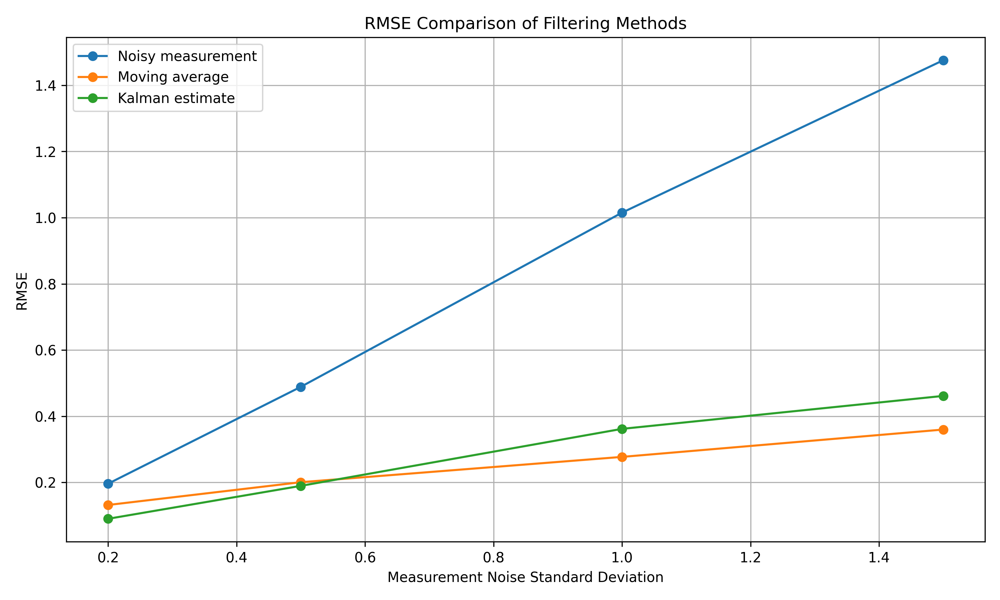
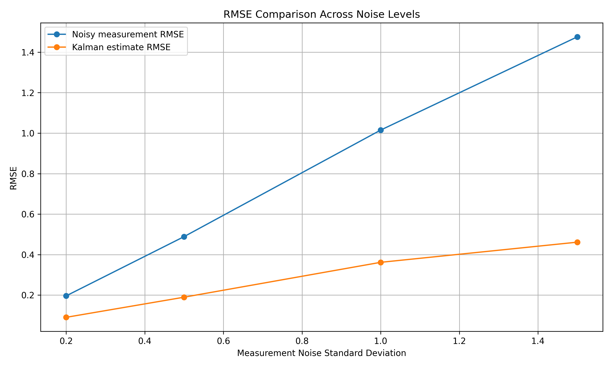

# Kalman Filter DC Motor

State estimation project for a simulated DC motor using noisy speed measurements, a Kalman Filter estimator, and a Moving Average baseline.

This project demonstrates a small but meaningful workflow at the intersection of:

- dynamic systems
- sensor noise modeling
- state estimation
- filtering
- control-oriented system analysis
- intelligent physical systems

The main goal is to show how noisy measurements from a dynamic system can be filtered to recover a better estimate of the true system state.

---

## Project Overview

In many real engineering systems, sensor readings are noisy and cannot be used directly without filtering or estimation. This project uses a simulated DC motor to demonstrate that problem in a clean and interpretable way.

The workflow is:

`DC motor simulation → noisy speed measurement → filtering/estimation → RMSE comparison → visualization`

The project compares two filtering approaches:

- **Kalman Filter**
- **Moving Average Filter**

The Kalman Filter is used as the main estimation method, while the Moving Average Filter is included as a simple baseline.

---

## Why This Project Matters

This project is useful because it connects several important engineering ideas in one compact example:

- modeling a physical dynamic system
- simulating noisy sensor measurements
- estimating hidden or corrupted states
- comparing filtering methods quantitatively
- building intuition for estimation in robotics, control, and embedded sensing systems

This makes the project relevant to:

- control systems
- state estimation
- robotics
- embedded systems
- sensor processing
- intelligent physical systems

---

## Main Idea

The project compares four signals:

- true motor speed
- noisy measured speed
- Moving Average estimate
- Kalman Filter estimate

The purpose is to study how filtering improves measurement quality and to compare a model-based estimator with a simple smoothing baseline.

---

## DC Motor Model

The DC motor model includes the following system variables:

- armature current
- angular velocity
- angular position

The simplified dynamics are based on standard electrical and mechanical equations of a DC motor.

Model parameters include:

- resistance
- inductance
- back EMF constant
- torque constant
- inertia
- friction
- input voltage

The motor is simulated under a step voltage input, which produces the true response signals used later in the estimation pipeline.

---

## Project Pipeline

### 1. DC Motor Simulation

The motor model is simulated to generate the true system response.

Generated signals:

- current
- true speed
- true position

### 2. Noisy Measurement Generation

Gaussian noise is added to the true motor speed signal to simulate noisy sensor measurements.

This produces a more realistic observed signal that would resemble noisy encoder or sensor readings in practice.

### 3. Kalman Filter Estimation

A Kalman Filter is used to estimate motor speed from noisy measurements.

The filter uses a simple state model with:

- speed
- acceleration

This estimator is the main filtering method studied in the project.

### 4. Moving Average Baseline

A Moving Average Filter is applied as a baseline smoothing method.

This provides a simple reference point for comparison with the Kalman Filter.

### 5. Error Analysis

The project compares estimation quality using RMSE.

Compared error sources:

- raw noisy measurement error
- Moving Average estimation error
- Kalman Filter estimation error

### 6. Noise-Level Comparison

The filtering methods are evaluated under several measurement noise levels.

Tested noise standard deviations:

- `0.2`
- `0.5`
- `1.0`
- `1.5`

This helps show how the filtering methods behave as sensor noise becomes stronger.

---

## Key Results

Both the Kalman Filter and the Moving Average Filter improve estimation quality compared to the raw noisy measurements.

Noise comparison summary:

| Noise STD | Measurement RMSE | Moving Average RMSE | Kalman RMSE | Moving Average Improvement | Kalman Improvement |
|---|---:|---:|---:|---:|---:|
| 0.2 | 0.196 | 0.132 | 0.090 | 32.75% | 54.03% |
| 0.5 | 0.489 | 0.201 | 0.190 | 58.94% | 61.21% |
| 1.0 | 1.015 | 0.277 | 0.362 | 72.70% | 64.35% |
| 1.5 | 1.475 | 0.360 | 0.461 | 75.62% | 68.73% |

Key observations:

- both filters reduce estimation error relative to the raw noisy measurements
- the Kalman Filter performs better for lower and moderate noise levels in the current setup
- the Moving Average baseline performs better at higher noise levels with the current Kalman tuning
- Kalman Filter performance depends strongly on appropriate tuning of process noise and measurement noise parameters

This makes the project a useful small-scale study of model-based estimation versus simple signal smoothing.

---

## Output Figures

The project generates several result figures to visualize estimation quality and filtering performance.

### Speed Estimation

This figure compares the true DC motor speed, noisy measurement, Moving Average estimate, and Kalman Filter estimate.



### Estimation Error

This figure shows the estimation error of the filtering methods over time.



### Filter Comparison

This figure compares filtering behavior between the Kalman Filter and the Moving Average baseline.



### Noise-Level RMSE Comparison

This figure compares RMSE values across different measurement noise levels.



### Noise Comparison

This figure summarizes how measurement noise level affects filtering performance.



---

## Repository Structure

```text
kalman-filter-dc-motor/
├── data/
│   ├── dc_motor_noisy_data.csv
│   └── noise_comparison.csv
├── results/
│   ├── estimation_error.png
│   ├── filter_comparison.png
│   ├── filter_rmse_comparison.png
│   ├── noise_comparison.png
│   └── speed_estimation.png
├── src/
│   ├── baseline_filter.py
│   ├── evaluate.py
│   ├── kalman_filter.py
│   ├── main.py
│   ├── model.py
│   ├── plots.py
│   └── simulate.py
├── requirements.txt
└── README.md
```

---

## Main Files

Important files in this project:

- `src/model.py` — DC motor dynamics
- `src/simulate.py` — simulation of the motor response
- `src/kalman_filter.py` — Kalman Filter implementation
- `src/baseline_filter.py` — Moving Average baseline
- `src/evaluate.py` — performance comparison across noise levels
- `src/plots.py` — result visualization
- `src/main.py` — main project runner

---

## How to Run

Create and activate a virtual environment:

`python3 -m venv venv`

`source venv/bin/activate`

Install dependencies:

`pip install -r requirements.txt`

Run the main project pipeline:

`python src/main.py`

Run only the noise-level evaluation:

`python src/evaluate.py`

---

## Main Libraries

- `numpy`
- `scipy`
- `matplotlib`
- `pandas`
- `filterpy`

---

## Project Goal

The goal of this project is to connect:

- dynamic system modeling
- noisy sensor measurements
- state estimation
- filtering
- quantitative error analysis

It is designed as a small portfolio project showing how estimation methods can improve measurement quality in dynamic systems.

---

## Limitations

This project has several limitations:

- the DC motor system is simulated rather than measured from real hardware
- the Kalman Filter uses a simplified state model
- the filter is tuned for this specific setup and may not be optimal for all noise levels
- only one baseline method is included
- the project focuses on speed estimation, not full state estimation or control

These limitations are acceptable for a compact educational project, but they also suggest clear directions for extension.

---

## Future Work

Possible next steps:

- tune Kalman Filter parameters for different noise levels
- estimate both speed and position
- compare against exponential moving average filtering
- test additional baselines
- extend the model toward state-space control analysis
- add an Extended Kalman Filter for nonlinear cases
- apply the method to real sensor data from a physical DC motor setup

---

## Summary

This project demonstrates a clean and interpretable estimation pipeline for a dynamic system.

It shows that:

- noisy measurements can be improved through filtering
- a Kalman Filter can outperform raw measurements and simple baselines under many conditions
- estimation quality depends on model assumptions and tuning
- dynamic systems, sensing, and data processing can be combined into a compact engineering workflow

Overall, this project serves as a portfolio-friendly example of state estimation for intelligent physical systems.
